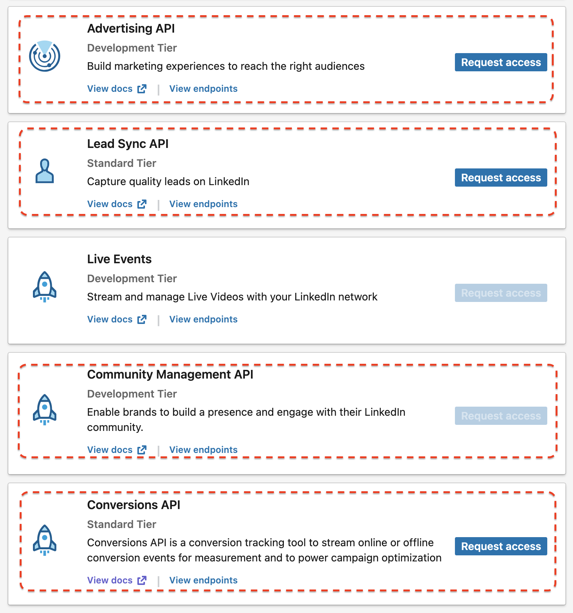

# rlinkedinads

<!-- badges: start -->
<!-- badges: end -->

rlinkedinads - R пакет для работы с [Linkedin Advertising API](https://developer.linkedin.com/product-catalog/marketing/advertising-api).

## Установка

Вы можете установить пакет rlinkedinads из [GitHub](https://github.com/selesnow/rlinkedinads) с помощью:

``` r
# install.packages("pak")
pak::pak("selesnow/rlinkedinads")
```

## Начало работы с Linkedin Advertising API

Подробное описание о начале работе с Linkedin Advertising API можно найти в [справке].

Обязательными шагами является создание вашего OAuth приложения, создать его можно на [этой странице](https://www.linkedin.com/developers/apps/new).
Так же обязательным шагом является активирование Advertising API в вашем приложении, для этого перейдите в раздел "Products" вашего приложения и подайте заявку на доступ к Advertising API. 



В разделе "Authorized redirect URLs for your app" вашего приложения добавьте URL - `https://selesnow.github.io/rlinkedinads/inst/get_code/auth_code.html`.

# Авторизация

В разделе "Auth" вашего OAuth приложения вы найдёте Client ID и Client Secret, необходимые для прохождения авторизации и обновления ваших токенов. Создайте две переменные среды для их хранения в файле `.Renviron`.

Открыть файл для редактирования переменных среды можно командой usethis::edit_r_environ(), далее добавьте в него 2 строки:

```
LKD_CLIENT_ID=Client ID вашего OAuth приложения
LKD_CLIENT_SECRET=Client secret вашего OAuth приложения 
```

Далее используйте функцию 

```r
library(rlinkedinads)
lkd_set_login('ВАШ ЛОГИН')
lkd_auth()
```

Вы будете перенаправлены в браузер, после чего вы даёте разрешение пакету на доступ к данным, и полученные авторизационные данные будут закешированы на вашем жестком диске, для того, что бы не потребовалась ручная авторизация в каждой последующей сессии работы с Linkedin Advertising API.

## Пример запроса данных

``` r
library(rlinkedinads)

lkd_set_login('ВАШ ЛОГИН')
lkd_set_account_id(ID ВАШЕГО РЕКЛАМНОГО АККАУНТА)

# Иерархия рекламного аккаунта
accounts        <- lkd_get_accounts()
user_accounts   <- lkd_get_accounts_by_authenticated_user()
account_users   <- lkd_get_ad_account_users_by_accounts(account_urn_id = 'urn:li:sponsoredAccount:511009658')
campaign_groups <- lkd_get_campaign_groups()
campaigns       <- lkd_get_campaigns()
creatives       <- lkd_get_creatives()

# Запрос аналитики
report <- lkd_get_ads_analytics(
      pivot            = 'CAMPAIGN',
      date_from        = '2023-01-01',
      date_to          = '2023-06-30',
      time_granularity = 'DAILY',
      fields           = c(
        'pivotValues',
        'dateRange',
        'clicks',
        'impressions',
        'dateRange',
        'costInUsd',
        'oneClickLeads',
        'externalWebsiteConversions'
      ),
      accounts  = 'urn:li:sponsoredAccount:511009658', 
      campaigns = c(
        'urn:li:sponsoredCampaign:253102116', 
        'urn:li:sponsoredCampaign:276103383'
      )
) 
```
